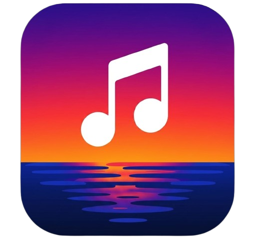

<div align="center">
  
</div>

<div align="center">
  <h1>Nest Music — Desktop</h1>
  <p>An unofficial desktop player for YouTube Music.</p>

  [](https://github.com/Davidix07TV/Nest-Music/releases/latest)
  [](https://tauri.app)
  [](LICENSE)
</div>

---

> **Attribution**: the Nest Music desktop app was formerly known as **Kodama**, by
> [KiyoshiTheDevil](https://github.com/KiyoshiTheDevil/Kodama). Nest Music continues that work as its own
> desktop client and keeps the original **AGPL-3.0** attribution. Kodama was created with help from LLMs
> (see the AI notice below, kept from the original project).

> AI notice (from the original Kodama project): This app has been created with an LLM called **Claude Code**. If you're against the usage of LLMs or AI in any capacity, this app won't be for you. I hope you understand.

## Features

- **Synced lyrics** with word- and syllable-level timing, plus **Unison** community lyrics.
- **Lyrics Composer** for creating and editing your own.
- **Crossfade** and a built-in **visualizer**.
- **Remote control** from your phone.
- **OBS overlay** for streaming.
- **Offline downloads**, Discord Rich Presence, and Last.fm scrobbling.

## Reporting issues and bugs

I highly recommend to send a bug report in the new [Discord-Server](https://discord.gg/rhreShDJxn), because that's easier for me to access, track, sort and handle in contrast to GitHub's unstable platform.
**Starting August, I will stop actively checking issues on GitHub.**

## Download

Grab the latest build from the [**Releases**](https://github.com/Davidix07TV/Nest-Music/releases/latest) page:

**Windows:** download and run the `*_x64-setup.exe` installer from the latest release.

**Linux (x86_64):** either the portable **AppImage** or the **.deb** for Debian/Ubuntu and
derivatives. Both are produced by the **Desktop Linux Bundles** workflow (artifact
`nest-music-linux-bundles`) and attached to the release:

```bash
# .deb — Debian, Ubuntu, Linux Mint, Pop!_OS, …
sudo apt install ./nest-music_*_amd64.deb

# AppImage — FUSE 2 is not preinstalled on Ubuntu 22.04 and newer
sudo apt install libfuse2t64
chmod +x Nest_Music_*_amd64.AppImage
./Nest_Music_*_amd64.AppImage

# … or without FUSE at all (extracts to a temp dir first):
./Nest_Music_*_amd64.AppImage --appimage-extract-and-run
```

Things worth knowing on Linux:

- The bundles are built on Ubuntu 24.04, so they need **glibc ≥ 2.39** (Ubuntu 24.04+,
  Debian 13+, Fedora 40+, Arch, openSUSE Leap 15.6+). On older distributions, build from
  source (below).
- The main window uses your **native window decorations**; the mini player and the overlay
  editor stay borderless and resize from their edges, same as on Windows.
- The tray icon needs an AppIndicator / StatusNotifier host — present on Ubuntu and KDE,
  on plain GNOME install the *AppIndicator and KStatusNotifierItem Support* extension.
  Without one, *close to tray* hides the window with nothing to click: launching Nest Music
  again brings it back, or turn the setting off.
- The in-app updater replaces the **AppImage**; `.deb` installs are updated by installing the
  newer package (`sudo apt install ./nest-music_*_amd64.deb`).
- Media keys and MPRIS work (playerctl, GNOME's media controls, KDE Plasma), Discord Rich
  Presence uses the local Discord socket, and Last.fm scrobbling needs no extra setup.
- Bug reports are sent without a screenshot (native window capture is Windows-only).

**macOS (Apple Silicon):** this repository does not publish macOS bundles yet. The build
config (`src-tauri/tauri.macos.conf.json`) and `install.sh` are inherited from the upstream
Kodama project — the script still points at those releases, so it will not fetch a Nest Music
build. Build from source instead (`npm run tauri build` on an Apple Silicon Mac, see
*For Developers* below).

## Screenshots

<!-- TODO: add fresh screenshots of the current app (player, lyrics, library, settings). -->
No screenshot available... yet.


> A Google account is not required to use the player, Premium isn't required either.
> Please be aware, that some content might be inaccessable due to Premium restrictions.

## NEW! Discord Server

Hey! I made a dedicated Discord server for the App, where you can chat about the project and send in bugs and suggestions more directly

>> [https://discord.gg/PzSsPF7KW](https://discord.gg/rhreShDJxn)

## For Developers

### Prerequisites

- [Node.js](https://nodejs.org/) v18+ (the bundled runtime the sidecar uses is v22)
- [Rust](https://rustup.rs/) (stable)
- [Python](https://www.python.org/) 3.10+

On Linux the Rust crates also link against the system webview, ALSA, dbus and the tray
libraries, so install the build packages first (Debian/Ubuntu):

```bash
sudo apt update
sudo apt install -y \
  libwebkit2gtk-4.1-dev build-essential curl wget file pkg-config \
  libxdo-dev libssl-dev libayatana-appindicator3-dev librsvg2-dev \
  libasound2-dev libdbus-1-dev autoconf automake libtool \
  python3-venv libpython3.11
```

`libasound2-dev` is for the native audio engine (cpal/rodio), `libdbus-1-dev` for MPRIS
media controls (souvlaki), `libayatana-appindicator3-dev` for the tray icon, and the
autotools trio because `audiopus_sys` compiles libopus from source.

PyInstaller freezes the sidecar against the **shared** libpython, which Debian/Ubuntu ship
in a separate package (`libpython3.11` on Debian 12, `libpython3.12` on Ubuntu 24.04 —
adjust to your Python version). Without it `build_server.sh` stops immediately and says so.
GitHub Actions does not need it: `actions/setup-python` installs a standalone interpreter
that always includes the shared library.

### Setup

```bash
# 1. Clone
git clone https://github.com/Davidix07TV/Nest-Music.git
cd Nest-Music/desktop

# 2. Frontend dependencies
npm ci

# 3. Python backend dependencies
#    (py = Windows launcher; on Linux/macOS use python3 -m pip. On Linux build_server.sh
#     does this for you inside its own .venv, so this step is optional there.)
cd python-backend
py -m pip install -r requirements.txt
py -m pip install pyinstaller
cd ..

# 4. (Optional) Authenticate with your YouTube account
cd python-backend
python setup_auth.py
cd ..
```

### Run in development mode

```bash
npm run tauri dev
```

### Build (Windows installer)

The Tauri bundle requires the Python sidecar to be built first — Tauri expects it at
exactly `src-tauri/binaries/nest-music-server-x86_64-pc-windows-msvc.exe` (the
`externalBin` entry `binaries/nest-music-server` plus the Rust target triple).
`build_server.bat` produces that file and also downloads the bundled `node.exe`
resource into `src-tauri/resources/` (required by `tauri.windows.conf.json`).

```bat
cd desktop
npm ci
cd python-backend
py -m pip install -r requirements.txt
py -m pip install pyinstaller
.\build_server.bat
cd ..
npm run tauri build
```

The NSIS installer is written to
`desktop/src-tauri/target/release/bundle/nsis/*-setup.exe`.

On CI the same steps run automatically via the manual
**Desktop Windows Installer** workflow (`.github/workflows/desktop-windows.yml`),
which uploads the installer as a downloadable artifact.

### Build (Linux AppImage + .deb)

The contract is the same as on Windows: Tauri needs the Python sidecar at exactly
`src-tauri/binaries/nest-music-server-x86_64-unknown-linux-gnu` (the `externalBin` entry
plus the Rust target triple), plus the bundled `node` runtime that
`src-tauri/tauri.linux.conf.json` declares as a resource. `build_server.sh` produces both —
it creates its own `.venv`, installs `requirements.txt` + PyInstaller, freezes `server.py`
with the Linux `.spec`, and downloads Node 22 into `src-tauri/resources/`.

```bash
cd desktop
npm ci                    # frontend deps (Vite + the Tauri CLI)
cd python-backend
./build_server.sh         # sidecar + bundled node
cd ..
npm run tauri build -- --bundles appimage,deb
```

The bundles land in `desktop/src-tauri/target/release/bundle/appimage/*.AppImage` and
`desktop/src-tauri/target/release/bundle/deb/*.deb`.

For a release-equivalent sidecar, pass the two extras the CI builds with:

```bash
./build_server.sh --with-composer --with-potgen
```

`--with-composer` builds the vendored Lyrics Composer (`composer/dist`) that the frozen
server serves, `--with-potgen` builds the bgutil PO-token generator into
`src-tauri/resources/potgen/server` and registers it as a Tauri resource for that build.
Without them the app still runs — Premium-only tracks may fail to stream and the Lyrics
Composer is unavailable.

Two environment variables matter for the AppImage:

```bash
# Hosts without FUSE 2 (all GitHub runners) must let appimagetool extract instead of mount:
export APPIMAGE_EXTRACT_AND_RUN=1

# Only needed to also emit the .AppImage.sig the in-app updater verifies:
export TAURI_SIGNING_PRIVATE_KEY=... TAURI_SIGNING_PRIVATE_KEY_PASSWORD=...
npm run tauri build -- --bundles appimage,deb --config '{"bundle":{"createUpdaterArtifacts":true}}'
```

On CI this is the **Desktop Linux Bundles** workflow
(`.github/workflows/desktop-linux.yml`), running on `ubuntu-24.04`. It can be triggered
manually, and on a `v*` tag it additionally attaches the bundles to that release and adds
the `linux-x86_64` entry to `desktop/updates/latest.json` — that last step requires the
`TAURI_SIGNING_PRIVATE_KEY` secret; without it the workflow still produces both bundles as
downloadable artifacts.

---

## Changelog

See [CHANGELOG.md](CHANGELOG.md) for a full version history.

## License

Nest Music is licensed under the **[GNU Affero General Public License v3.0](LICENSE)** (AGPL-3.0).
You are free to use, study, modify and redistribute it, provided derivative works remain under
the same license and their source is made available.

The bundled lyrics Composer is a vendored component licensed under the AGPL-3.0 as well.

## Disclaimer

Nest Music is an **unofficial** client and is **not affiliated with or endorsed by YouTube or
Google**. It relies on the unofficial YouTube Music API and is provided for personal use, as-is
and without warranty. Use at your own risk.
